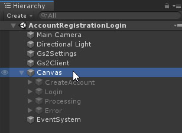
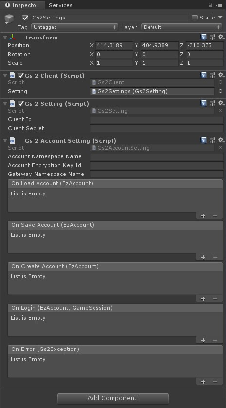
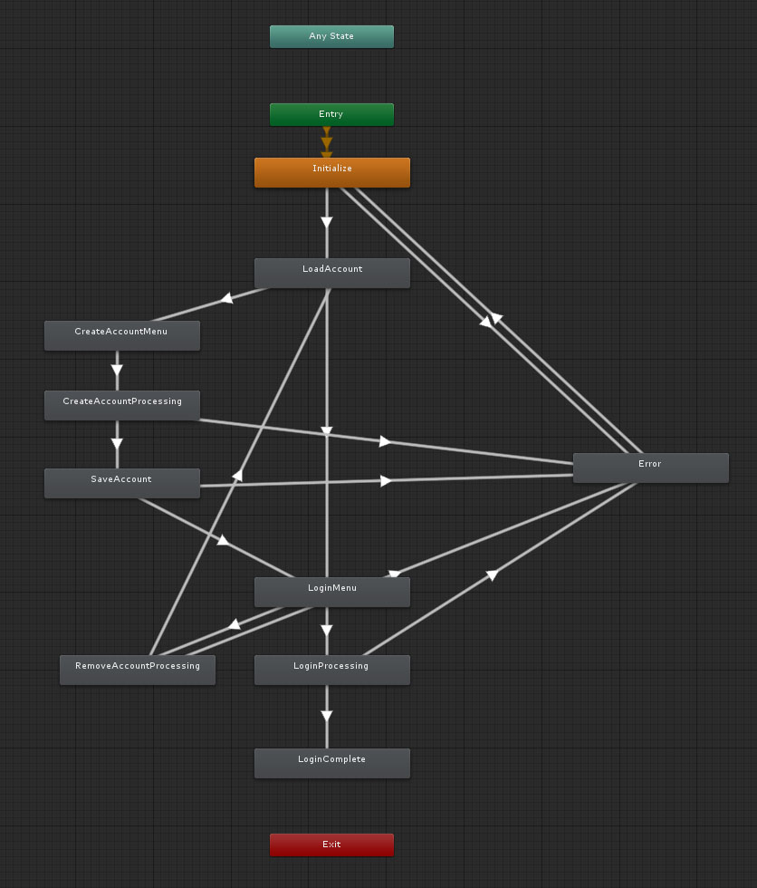

# アカウントの作成・ログイン

GS2-Account を使用してゲームにログイン機能を追加するサンプル。

# 依存

- gs2-sdk-for-unity
- Core

# 初期設定

## GS2-Deploy を使って初期設定をおこなう

- [initialize_credential_template.yaml - core](../core/initialize_credential_template.yaml)
- [initialize_account_template.yaml](initialize_account_template.yaml)

のスタックを作成します。
しばらく待ってすべてのスタックの状態が `CREATE_COMPLETE` になれば初期設定は完了です。

## Gs2Settings に設定を反映

Run シーンを開きます。



ヒエラルキーウィンドウで `Gs2Settings` を選択します。



インスペクターウィンドウで GS2-Deploy で作成したリソースの情報を登録します。

| 設定名 | 説明 |
---------|------
| accountNamespaceName | GS2-Account のネームスペース名 |
| accountEncryptionKeyId | GS2-Account でアカウント情報の暗号化に使用する GS2-Key の暗号鍵GRN |
| gatewayNamespaceName | GS2-Gateway のネームスペース名 |

コールバックを設定することで、イベントに合わせて処理を追加することができます。

| イベント | 説明 |
---------|------
| OnLoadAccount(EzAccount account) | アカウントがロードされたときに呼び出されます。 |
| OnSaveAccount(EzAccount account) | アカウントがセーブされたときに呼び出されます。 |
| OnCreateAccount(EzAccount account) | アカウントが作成されたときに呼び出されます。 |
| OnLogin(EzAccount account, GameSession session) | ログインに成功したときに呼び出されます。 |
| OnError(Gs2Exception error) | エラーが発生したときに呼び出されます。 |

設定が出来たら Unity Editor 上でシーンを実行することで動作を確認できます。

# ステートマシン



## ステートの種類

### Initialize

初期化ステートです。
`AccountMenuStateMachine::Initialize()` を呼び出すことで `LoadAccount` ステートに遷移します。

### LoadAccount

ローカルストレージから登録済みのアカウント情報を読み込みます。
読み込みに失敗すると `CreateAccountMenu` ステートに遷移します。
読み込みに成功すると `LoginMenu` ステートに遷移します。

### CreateAccountMenu

アカウント作成ボタンを表示するステートです。
`アカウント作成` ボタンをクリックすると `CreateAccountProgressing` ステートに遷移します。

### CreateAccountProgressing

GS2-Account の API を使用してアカウントを作成します。

```csharp
AsyncResult<EzCreateResult> result = null;
yield return gs2Client.client.Account.Create(
    r =>
    {
        result = r;
    },
    gs2AccountSetting.accountNamespaceName
);
```

アカウントの作成に成功すると `SaveAccount` ステートに遷移し、失敗すると `Error` ステートに遷移します。

### SaveAccount

ローカルストレージに登録したアカウント情報を保存します。
保存に失敗すると `Error` ステートに遷移します。
保存に成功すると `LoginMenu` ステートに遷移します。

### LoginMenu

ログインボタンを表示するステートです。
`ログイン` ボタンをクリックすると `LoginProgressing` ステートに遷移します。
`アカウントを削除` ボタンをクリックすると `RemoveAccountProcessing` に遷移します。

### RemoveAccountProcessing

アカウント情報をローカルストレージから削除します。
成功すると `LoadAccount` ステートに遷移し、失敗すると `Error` ステートに遷移します。

### LoginProcessing

ログイン処理を実行するステートです。

```csharp
AsyncResult<GameSession> result1 = null;
yield return gs2Client.profile.Login(
    new Gs2AccountAuthenticator(
        gs2Client.profile.Gs2Session,
        gs2AccountSetting.accountNamespaceName,
        gs2AccountSetting.accountEncryptionKeyId,
        _account.UserId,
        _account.Password
    ),
    r =>
    {
        result1 = r;
    }
);
```

GS2-Account のログイン処理だけでなく、WebSocketセッションに対してログインしたユーザIDを設定してプッシュ通知を受け取れるようにもしています。
成功すると `LoginComplete` ステートに遷移し、失敗すると `Error` ステートに遷移します。

### LoginComplete

ログインが正常に完了した場合に遷移するステートです。
ステートマシンはこのステートになると終了します。
