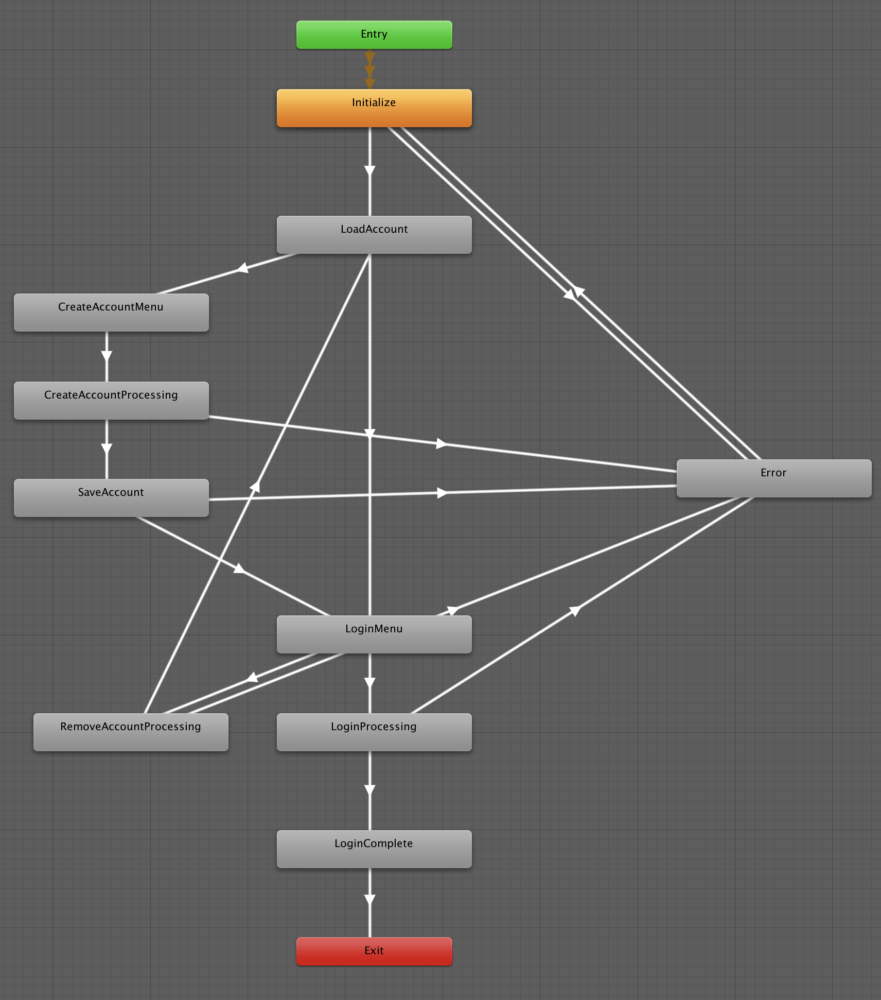

# アカウントの作成・ログイン

GS2-Account を使用してゲームにログイン機能を追加するサンプル。

# 依存

- gs2-sdk-for-unity
- Core

# 初期設定

[Core ライブラリ](../core) の初期設定を済ませてから読み進めてください。

## GS2-Deploy を使って初期設定をおこなう

`initialize_account_template.yaml` をアップロードします。
しばらく待ってスタックの状態が `CREATE_COMPLETE` になれば初期設定は完了です。

## GsAccount2Settings に設定を反映


ヒエラルキーウィンドウで `Canvas` という名前の GameObject を選択します。


インスペクターウィンドウで GS2-Deploy で作成したリソースの情報を登録します。

# パラメータ

ステートマシンを動作させる際に指定するパラメータ

## AccountMenuRequest

なし

## Gs2AccountSetting

### accountNamespaceName

GS2-Account のネームスペース名

### accountEncryptionKeyId

GS2-Account でアカウント情報の暗号化に使用する GS2-Key の暗号鍵GRN

### gatewayNamespaceName

GS2-Gateway のネームスペース名

# ステートマシン



## ステートの種類

### Initialize

初期化ステートです。
`AccountMenuStateMachine::Initialize()` を呼び出すことで `LoadAccount` ステートに遷移します。

### LoadAccount

ローカルストレージから登録済みのアカウント情報を読み込みます。
読み込みに失敗すると `CreateAccountMenu` ステートに遷移します。
読み込みに成功すると `LoginMenu` ステートに遷移します。

### CreateAccountMenu

アカウント作成ボタンを表示するステートです。
`アカウント作成` ボタンをクリックすると `CreateAccountProgressing` ステートに遷移します。

### CreateAccountProgressing

GS2-Account の API を使用してアカウントを作成します。

```csharp
/// <summary>
/// アカウントの作成処理
/// </summary>
/// <param name="animator"></param>
/// <returns></returns>
private IEnumerator CreateAccount(
    Animator animator
)
{
    AsyncResult<EzCreateResult> result = null;
    yield return _client.Account.Create(
        r =>
        {
            result = r;
        },
        _setting.accountNamespaceName
    );
    
    if (result.Error != null)
    {
        if (OnError != null)
        {
            OnError.Invoke(
                result.Error
            );
        }

        animator.SetTrigger(Trigger.CreateAccountFailed.ToString());
        yield break;
    }

    account = result.Result.Item;

    if (OnCreateAccount != null)
    {
        OnCreateAccount.Invoke(account);
    }

    animator.SetTrigger(Trigger.CreateAccountSucceed.ToString());
}
```

アカウントの作成に成功すると `SaveAccount` ステートに遷移し、失敗すると `Error` ステートに遷移します。

### SaveAccount

ローカルストレージに登録したアカウント情報を保存します。
保存に失敗すると `Error` ステートに遷移します。
保存に成功すると `LoginMenu` ステートに遷移します。

### LoginMenu

ログインボタンを表示するステートです。
`ログイン` ボタンをクリックすると `LoginProgressing` ステートに遷移します。
`アカウントを削除` ボタンをクリックすると `RemoveAccountProcessing` に遷移します。

### RemoveAccountProcessing

アカウント情報をローカルストレージから削除します。
成功すると `LoadAccount` ステートに遷移し、失敗すると `Error` ステートに遷移します。

### LoginProcessing

ログイン処理を実行するステートです。

```csharp
AsyncResult<GameSession> result1 = null;
yield return _profile.Login(
    new Gs2AccountAuthenticator(
        _profile.Gs2Session,
        _setting.accountNamespaceName,
        _setting.accountEncryptionKeyId,
        account.UserId,
        account.Password
    ),
    r =>
    {
        result1 = r;
    }
);

if (result1.Error != null)
{
    if (OnError != null)
    {
        OnError.Invoke(
            result1.Error
        );
    }

    animator.SetTrigger(Trigger.LoginFailed.ToString());
    yield break;
}

var session = result1.Result;

AsyncResult<EzSetUserIdResult> result2 = null;
yield return _client.Gateway.SetUserId(
    r => { result2 = r; },
    session,
    _setting.gatewayNamespaceName,
    true
);

if (result2.Error != null)
{
    if (OnError != null)
    {
        OnError.Invoke(
            result2.Error
        );
    }

    animator.SetTrigger(Trigger.LoginFailed.ToString());
    yield break;
}

animator.SetTrigger(Trigger.LoginSucceed.ToString());

if (OnLogin != null)
{
    OnLogin.Invoke(account, session);
}
```

GS2-Account のログイン処理だけでなく、WebSocketセッションに対してログインしたユーザIDを設定してプッシュ通知を受け取れるようにもしています。
成功すると `LoginComplete` ステートに遷移し、失敗すると `Error` ステートに遷移します。

### LoginComplete

ログインが正常に完了した場合に遷移するステートです。
ステートマシンはこのステートになると終了します。

# トリガー

ステートマシンのステート遷移をコントロールするトリガーです。

## InitializeSucceed

初期化が成功したときに発火するトリガーです。

## InitializeFailed

初期化が失敗したときに発火するトリガーです。

## LoadAccountSucceed

ローカルストレージからアカウント情報のロードに成功したときに発火するトリガーです。

## LoadAccountFailed

ローカルストレージからアカウント情報のロードに失敗したときに発火するトリガーです。

## SelectCreateAccount

「アカウントの作成」ボタンをクリックしたときに発火するトリガーです。

## CreateAccountSucceed

アカウントの新規作成が成功したときに発火するトリガーです。

## CreateAccountFailed

アカウントの新規作成が失敗したときに発火するトリガーです。

## SaveAccountSucceed

アカウント情報をローカルストレージに保存するのに成功したときに発火するトリガーです。

## SaveAccountFailed

アカウント情報をローカルストレージに保存するのに失敗したときに発火するトリガーです。

## SelectLogin

「ログイン」ボタンをクリックしたときに発火するトリガーです。

## LoginSucceed

ログインに成功したときに発火するトリガーです。

## LoginFailed

ログインに失敗したときに発火するトリガーです。

## SelectRemoveAccount

「アカウントの削除」ボタンをクリックしたときに発火するトリガーです。

## RemoveAccountSucceed

ローカルストレージからアカウント情報の削除に成功したときに発火するトリガーです。

## RemoveAccountFailed

ローカルストレージからアカウント情報の削除に失敗したときに発火するトリガーです。

## ResultCallback

ログイン結果のコールバックを返したあとに発火するトリガーです。

## ConfirmError

エラーページで「戻る」ボタンをクリックしたときに発火するトリガーです。

# コールバック

ステートマシンの実装を拡張したいときに使用できるコールバックポイントを用意しています。
コールバックはメインスレッドから呼び出されます。

## OnChangeState(State state)

ステートマシンのステートが変化したときに呼び出されます。

## OnCreateAccount(EzAccount account)

アカウントが作成されたときに呼び出されます。

## OnLogin(EzAccount account, GameSession session)

ログインに成功したときに呼び出されます。

## OnError(Gs2Exception error)

エラーが発生したときに呼び出されます。