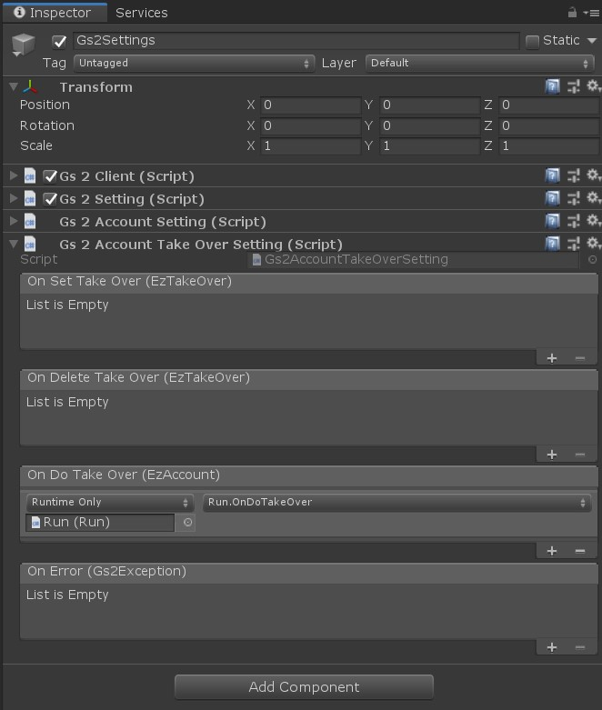
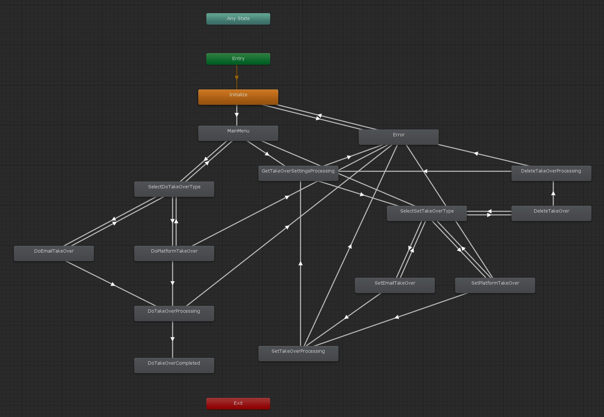

# アカウント引継ぎ

GS2-Account で作成された匿名アカウントにメールアドレスや、
Game Center/Google Play Game Service のアカウントを関連付けて引継ぎをできるようにするサンプルです。

# 初期設定

## Unity でプロジェクトを開く

`gs2-sample/unity/account-takeover` をプロジェクトとして開きます。
すると、 Unity Package Manager が依存関係を解決してプロジェクトを開きます。

## GS2-Deploy を使って初期設定をおこなう

- [initialize_credential_template.yaml - core](../core/initialize_credential_template.yaml)
- [initialize_account_template.yaml - account-registration-login](initialize_account_template.yaml)

のスタックを作成します。
しばらく待ってすべてのスタックの状態が `CREATE_COMPLETE` になれば初期設定は完了です。

## Gs2Settings に設定を反映

Run シーンを開きます。


ヒエラルキーウィンドウで `Gs2Settings` を選択します。



インスペクターウィンドウで GS2-Deploy で作成したリソースの情報を登録します。

| スクリプトファイル | 設定名 | 説明 |
-----------------|------|------
| Gs2Settings | clientId | GS2 にアクセスするためのクレデンシャル（クライアントID） |
| Gs2Settings | clientSecret | GS2 にアクセスするためのクレデンシャル（クライアントシークレット） |
| Gs2AccountSettings | accountNamespaceName | GS2-Account のネームスペース名 |
| Gs2AccountSettings | accountEncryptionKeyId | GS2-Account でアカウント情報の暗号化に使用する GS2-Key の暗号鍵GRN |
| Gs2AccountSettings | gatewayNamespaceName | GS2-Gateway のネームスペース名 |

コールバックを設定することで、イベントに合わせて処理を追加することができます。

| イベント | 説明 |
---------|------
| OnSetTakeOver(EzTakeOver takeOver) | アカウントの引継ぎ情報が設定されたとき。 |
| OnDeleteTakeOver(EzTakeOver takeOver) | アカウントの引継ぎ情報が削除されたとき。 |
| OnDoTakeOver(EzAccount takeOver) | アカウントの引継ぎが実行されたとき。 |
| OnError(Gs2Exception error) | エラーが発生したときに呼び出されます。 |

設定が出来たら Unity Editor 上でシーンを実行することで動作を確認できます。

## AccountTakeOverRequest

ステートマシンを動作させるために引数としてシーンに設定する Prefab。

**サンプルを Run シーンから実行する場合は自動的に生成されるため、設定する必要はありません。**

| パラメータ名 | 説明 |
------------|-----
| gameSession | ログイン済みのゲームセッション |

# ステートマシン



## ステートの種類

### Initialize

初期化ステートです。
`AccountTakeOverMenuStateMachine::Initialize()` を呼び出すことで `MainMenu` ステートに遷移します。

### MainMenu

アカウントの引継ぎのメインメニュー

引継ぎ情報を登録するか、引継ぎを実行するかを選択する。
このサンプルではログイン状態にならないとこのメニューに到達できませんが、
引継ぎを実行するメニューより先はログイン状態である必要はありません。

### SelectDoTakeOverType

引継ぎを実行するメニュー

メールアドレス・パスワードを用いたデータ引継ぎか、
Game Center/Google Play Game Service のような配信プラットフォームアカウントを用いたデータ引継ぎかを選択します。
動作確認はしていませんが、 Unity の Social API を使用しているため、 Xbox Live ではマイクロソフトアカウントを使用した引継ぎなどが行えるはずです。

### GetTakeOverSettingsProcessing

引継ぎ情報を登録するメニューに遷移する前に現在設定されている引継ぎ設定を取得します。

```csharp
AsyncResult<EzListTakeOverSettingsResult> result = null;
yield return gs2Client.client.Account.ListTakeOverSettings(
    r => { result = r; },
    request.gameSession,
    gs2AccountSetting.accountNamespaceName
);
```

### SelectSetTakeOverType

引継ぎを設定するメニュー

メールアドレス・パスワードを用いたデータ引継ぎか、
Game Center/Google Play Game Service のような配信プラットフォームアカウントを用いたデータ引継ぎかを選択します。
動作確認はしていませんが、 Unity の Social API を使用しているため、 Xbox Live ではマイクロソフトアカウントを使用した引継ぎなどが行えるはずです。

### DoEmailTakeOver

メールアドレス・パスワードを用いたデータ引継ぎ実行メニュー

メールアドレスとパスワードを入力するためのメニューです。

### DoPlatformTakeOver

配信プラットフォームのアカウントでのデータ引継ぎを実行するメニュー

### SetEmailTakeOver

メールアドレス・パスワードを用いたデータ引継ぎ登録メニュー

メールアドレスとパスワードを入力するためのメニューです。

### SetPlatformTakeOver

配信プラットフォームのアカウントでのデータ引継ぎを登録するメニュー

### DoTakeOverProcessing

引継ぎ実行通信処理中

```csharp
AsyncResult<EzDoTakeOverResult> result = null;
yield return gs2Client.client.Account.DoTakeOver(
    r => { result = r; },
    gs2AccountSetting.accountNamespaceName,
    type,
    userIdentifier,
    password
);
```

### SetTakeOverProcessing

引継ぎ情報の登録通信処理中

```csharp
AsyncResult<EzAddTakeOverSettingResult> result = null;
yield return gs2Client.client.Account.AddTakeOverSetting(
    r => { result = r; },
    request.gameSession,
    gs2AccountSetting.accountNamespaceName,
    type,
    userIdentifier,
    password
);
```

### DeleteTakeOver

引継ぎ情報の削除確認メニュー

### DeleteTakeOverProcessing

引継ぎ情報の削除通信処理中

```csharp
AsyncResult<EzDeleteTakeOverSettingResult> result = null;
yield return gs2Client.client.Account.DeleteTakeOverSetting(
    r => { result = r; },
    request.gameSession,
    gs2AccountSetting.accountNamespaceName,
    type
);
```

### DoTakeOverCompleted

引継ぎ完了表示

### Error

エラーが発生した場合に遷移するステートです。
`メニューに戻る` を選択すると `Initialize` に戻ります
