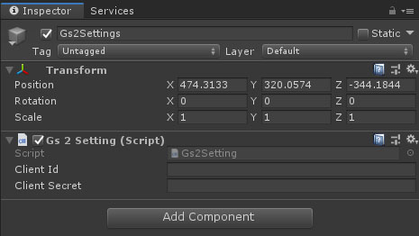

# Core

公開しているサンプルで共通するライブラリのリポジトリ

# 初期設定

## GS2-Deploy を使ってクレデンシャルを発行

クレデンシャルとは GS2 の API を呼び出すために必要な認証情報です。
管理画面からUIを使って登録することもできますが、複数の手順が必要となりますので、GS2-Deploy を使ってセットアップします。

GS2-Deploy は設定ファイルを基に GS2 への設定を一括して行う機能です。
GS2-Deploy に関する詳細な解説は [GS2-Documents のチュートリアル](https://app.gs2.io/docs/index.html#get-start) を参照してください。

```
GS2-Deploy > スタックの新規作成
```

で `initialize_credential_template.yaml` をアップロードします。
しばらく待ってスタックの状態が `CREATE_COMPLETE` になればクレデンシャルの発行は完了です。

他のサンプルでも基本的に初期設定は GS2-Deploy を使って行います。

## Gs2Settings にクレデンシャルの内容を設定

作成したスタックの情報の `アウトプットタブ` を開いてみてください。

`ApplicationClientId` `ApplicationClientSecret` という2つの値が確認できるはずです。
この値が GS2 にアクセスするために必要な `クライアントID` と `クライアントシークレット` です。

Unity Editor で動作確認したいサンプルの `Run` シーンを開きます。
`Gs2Settings` という GameObject がシーンに配置されているはずです。
ヒエラルキーウィンドウで `Gs2Settings` を選択してインスペクターを開きます。



すると、Gs2Settings というスクリプトが設定されており、
`Client Id` と `Client Secret` を設定するテキストフィールドがありますので。先ほど GS2-Deploy で作成した値を設定します。