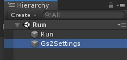
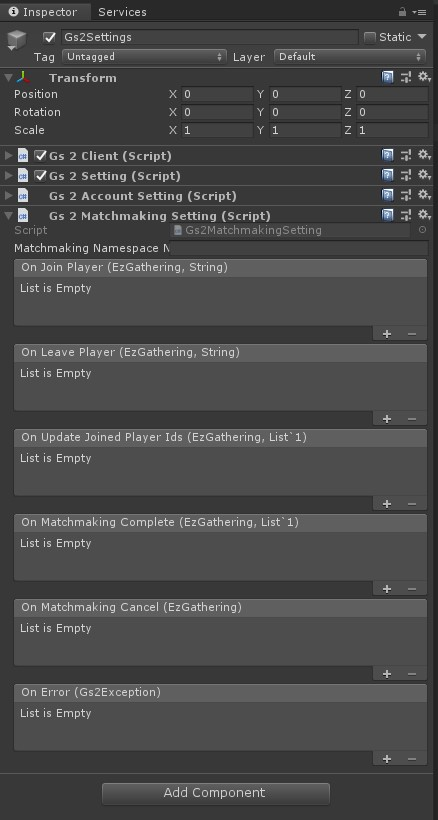
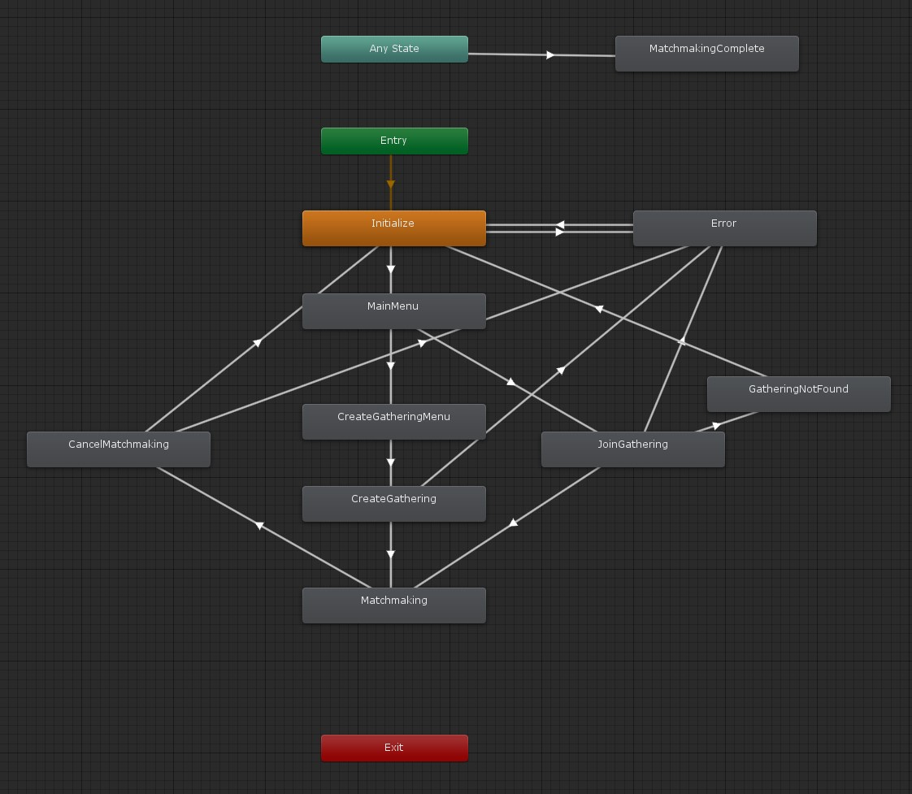

# マッチメイキング

GS2-Matchmaking を使用して対戦・協力プレイ相手を見つけるサンプル。

# 依存

- gs2-sdk-for-unity
- Core
- AccountRegistrationLogin

# 初期設定

## GS2-Deploy を使って初期設定をおこなう

- [initialize_credential_template.yaml - core](../core/initialize_credential_template.yaml)
- [initialize_account_template.yaml - account-registration-login](initialize_account_template.yaml)
- [initialize_matchmaking_template.yaml](initialize_matchmaking_template.yaml)

のスタックを作成します。
しばらく待ってすべてのスタックの状態が `CREATE_COMPLETE` になれば初期設定は完了です。

## Gs2Settings に設定を反映

Run シーンを開きます。



ヒエラルキーウィンドウで `Gs2Settings` を選択します。



インスペクターウィンドウで GS2-Deploy で作成したリソースの情報を登録します。

| 設定名 | 説明 |
---------|------
| matchmakingNamespaceName | GS2-Matchmaking のネームスペース名 |

コールバックを設定することで、イベントに合わせて処理を追加することができます。

| イベント | 説明 |
---------|------
| OnJoinPlayer(EzGathering gathering, string userId) | 参加中のギャザリングに新しい参加者が来た時に呼び出されます。 |
| OnLeavePlayer(EzGathering gathering, string userId) | 参加中のギャザリングから参加者が離脱した時に呼び出されます。 |
| OnUpdateJoinedPlayerIds(EzGathering gathering, List<string> joinedPlayerIds) | アカウントが作成されたときに呼び出されます。 |
| OnLogin(EzAccount account, GameSession session) | 参加中のギャザリングのプレイヤーIDリストが更新されたときに呼び出されます。 このコールバックは必ず OnJoinPlayer / OnLeavePlayer のいずれかと同じタイミングで呼び出されます。 |
| OnMatchmakingComplete(EzGathering gathering, List<string> joinedPlayerIds) | マッチメイキングが完了したときに呼び出されます。 |
| OnError(Gs2Exception error) | エラーが発生したときに呼び出されます。 |

設定が出来たら Unity Editor 上でシーンを実行することで動作を確認できます。

## MatchmakingRequest

ステートマシンを動作させるために引数としてシーンに設定する Prefab。

**サンプルを Run シーンから実行する場合は自動的に生成されるため、設定する必要はありません。**

| パラメータ名 | 説明 |
------------|-----
| gameSession | ログイン済みのゲームセッション |

# ステートマシン



## ステートの種類

### Initialize

初期化ステートです。
`MatchmakingMenuStateMachine::Initialize()` を呼び出すことで `MainMenu` ステートに遷移します。

### MainMenu

マッチング処理のメインメニュー
`ギャザリングの新規作成` を選択すると `CreateGatheringMenu` ステートに
`ギャザリングへ参加` を選択すると `JoinGathering` ステートに遷移します。

### CreateGatheringMenu

ギャザリングの新規作成メニュー
自分を含むプレイヤー人数を入力し、 `マッチメイキング開始` を選択すると `CreateGathering` ステートに遷移します。

### CreateGathering

ギャザリングの新規作成処理

```csharp
AsyncResult<EzCreateGatheringResult> result = null;
yield return gs2Client.client.Matchmaking.CreateGathering(
    r => { result = r; },
    request.gameSession,
    gs2MatchmakingSetting.matchmakingNamespaceName,
    new EzPlayer
    {
        RoleName = "default"
    },
    new List<EzCapacityOfRole>
    {
        new EzCapacityOfRole
        {
            RoleName = "default",
            Capacity = capacity
        },
    },
    new List<string>(),
    new List<EzAttributeRange>()
);
```

このサンプルでは募集条件を特に指定せず、誰でも参加可能なギャザリングを作成しています。
ギャザリングの作製に成功すると `Matchmaking` ステートに遷移します。

### JoinGathering

既存のギャザリングに参加する処理

```csharp
yield return gs2Client.client.Matchmaking.DoMatchmaking(
    r => { result = r; },
    request.gameSession,
    gs2MatchmakingSetting.matchmakingNamespaceName,
    new EzPlayer
    {
        RoleName = "default"
    },
    contextToken
);
```

このサンプルでは `default` ロールを募集しているギャザリングに参加します。
正常応答にもかかわらず `EzDoMatchmakingResult.Result.Item` が null の場合があります。
本当にギャザリングが見つからなかった場合は `NotFoundException` が返ります。
このケースはマッチメイキング処理途中にタイムアウトをしていったん処理が返ってきたときです。
そのため、同じく戻り値に含まれる `MatchmakingContextToken` を使って再度ギャザリングを探す処理を再開します。

マッチメイキングに成功し多場合 `Matchmaking` ステートに遷移します。
マッチメイキング対象のギャザリングが見つからなかった場合は `GatheringNotFound` ステートに遷移します。

### Matchmaking

マッチメイキングの完了まち。
`キャンセル` ボタンを選択した場合は `CancelMatchmaking` に遷移します。

### CancelMatchmaking

マッチメイキングをキャンセルするとき

```csharp
AsyncResult<EzCancelMatchmakingResult> result = null;
yield return gs2Client.client.Matchmaking.CancelMatchmaking(
    r => { result = r; },
    request.gameSession,
    gs2MatchmakingSetting.matchmakingNamespaceName,
    _gathering.Name
);
```

### MatchmakingComplete

マッチメイキングが完了したとき
ステートマシンはこのステートになると終了します。

### GatheringNotFound

参加できるギャザリングが見つからなったとき
`メニューに戻る` を選択すると `Initialize` に戻ります

### Error

エラーが発生した場合に遷移するステートです。
`メニューに戻る` を選択すると `Initialize` に戻ります
