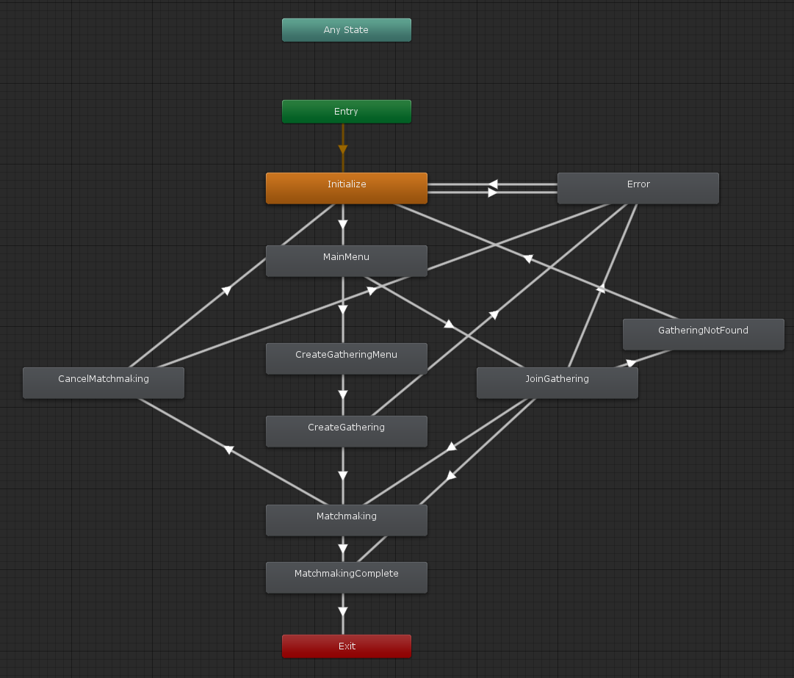

# マッチメイキング

GS2-Matchmaking を使用して対戦・協力プレイ相手を見つけるサンプル。

# 依存

- gs2-sdk-for-unity
- Core

# パラメータ

ステートマシンを動作させる際に指定するパラメータ

## MatchmakingMenuRequest

サンプルを動作させるために引数としてシーンに設定するコンポーネント。

### GameSession

ログイン済みのゲームセッション

## Gs2MatchmakingSetting

### matchmakingNamespaceName

GS2-Matchmaking のネームスペース名

# ステートマシン



## ステートの種類

### Initialize

初期化ステートです。
`MatchmakingMenuStateMachine::Initialize()` を呼び出すことで `MainMenu` ステートに遷移します。

### MainMenu

マッチング処理のメインメニュー
`ギャザリングの新規作成` を選択すると `CreateGatheringMenu` ステートに
`ギャザリングへ参加` を選択すると `JoinGathering` ステートに遷移します。

### CreateGatheringMenu

ギャザリングの新規作成メニュー
自分を含むプレイヤー人数を入力し、 `マッチメイキング開始` を選択すると `CreateGathering` ステートに遷移します。

### CreateGathering

ギャザリングの新規作成処理

```csharp
/// <summary>
/// 誰でもいいので参加者を募集するギャザリングを新規作成
/// </summary>
/// <param name="animator"></param>
/// <returns></returns>
private IEnumerator SimpleMatchmakingCreateGathering(
    Animator animator,
    int capacity
)
{
    AsyncResult<EzCreateGatheringResult> result = null;
    yield return _client.Matchmaking.CreateGathering(
        r => { result = r; },
        _gameSession,
        _setting.matchmakingNamespaceName,
        new EzPlayer
        {
            RoleName = "default"
        },
        new List<EzCapacityOfRole>
        {
            new EzCapacityOfRole
            {
                RoleName = "default",
                Capacity = capacity
            },
        },
        new List<string>(),
        new List<EzAttributeRange>()
    );
    
    if (result.Error != null)
    {
        if (OnError != null)
        {
            OnError.Invoke(
                result.Error
            );
        }

        animator.SetTrigger(Trigger.CreateGatheringFailed.ToString());
        yield break;
    }

    _matchmakingComplete = false;
    _joinedPlayerIds.Clear();
    gathering = result.Result.Item;
    _joinedPlayerIds.Add(_gameSession.AccessToken.userId);

    if (OnUpdateJoinedPlayerIds != null)
    {
        OnUpdateJoinedPlayerIds.Invoke(gathering, _joinedPlayerIds);
    }

    animator.SetTrigger(Trigger.CreateGatheringSucceed.ToString());
}
```

このサンプルでは募集条件を特に指定せず、誰でも参加可能なギャザリングを作成しています。
ギャザリングの作製に成功すると `Matchmaking` ステートに遷移します。

### JoinGathering

既存のギャザリングに参加する処理

```csharp
/// <summary>
/// 既存のギャザリングに参加する
/// </summary>
/// <param name="animator"></param>
/// <returns></returns>
private IEnumerator SimpleMatchmakingJoinGathering(
    Animator animator
)
{
    AsyncResult<EzDoMatchmakingResult> result = null;
    string contextToken = null;
    while (true)
    {
        yield return _client.Matchmaking.DoMatchmaking(
            r => { result = r; },
            _gameSession,
            _setting.matchmakingNamespaceName,
            new EzPlayer
            {
                RoleName = "default"
            },
            contextToken
        );
    
        if (result.Error != null)
        {
            if (OnError != null)
            {
                OnError.Invoke(
                    result.Error
                );
            }

            if (result.Error is NotFoundException)
            {
                animator.SetTrigger(Trigger.GatheringNotFound.ToString());
            }
            else
            {
                animator.SetTrigger(Trigger.JoinGatheringFailed.ToString());
            }
            yield break;
        }

        if (result.Result.Item != null)
        {
            gathering = result.Result.Item;
            if (!_matchmakingComplete)
            {
                animator.SetTrigger(Trigger.JoinGatheringSucceed.ToString());
            }
            else
            {
                if (OnMatchmakingComplete != null)
                {
                    OnMatchmakingComplete.Invoke(gathering, _joinedPlayerIds);
                }
                animator.SetTrigger(Trigger.MatchmakingSucceed.ToString());
            }
            yield break;
        }

        contextToken = result.Result.MatchmakingContextToken;
    }
}
```

このサンプルでは `default` ロールを募集しているギャザリングに参加します。
正常応答にもかかわらず `EzDoMatchmakingResult.Result.Item` が null の場合があります。
本当にギャザリングが見つからなかった場合は `NotFoundException` が返ります。
このケースはマッチメイキング処理途中にタイムアウトをしていったん処理が返ってきたときです。
そのため、同じく戻り値に含まれる `MatchmakingContextToken` を使って再度ギャザリングを探す処理を再開します。

マッチメイキングに成功し多場合 `Matchmaking` ステートに遷移します。
マッチメイキング対象のギャザリングが見つからなかった場合は `GatheringNotFound` ステートに遷移します。

### Matchmaking

マッチメイキングの完了まち。
`キャンセル` ボタンを選択した場合は `CancelMatchmaking` に遷移します。

マッチメイキングの途中経過は以下のイベントハンドラを使用してハンドリングできます。

```csharp
/// <summary>
/// 新しいプレイヤーがギャザリングに参加したとき
/// </summary>
public event JoinPlayerHandler OnJoinPlayer;

/// <summary>
/// プレイヤーがギャザリングから離脱したとき
/// </summary>
public event LeavePlayerHandler OnLeavePlayer;

/// <summary>
/// 参加中のプレイヤー一覧が更新されたとき
/// </summary>
public event UpdateJoinedPlayerIdsHandler OnUpdateJoinedPlayerIds;

/// <summary>
/// マッチメイキングが完了したとき
/// </summary>
public event MatchmakingCompleteHandler OnMatchmakingComplete;
```

### CancelMatchmaking

マッチメイキングをキャンセルするとき

```csharp
/// <summary>
/// マッチメイキングをキャンセルしたとき
/// </summary>
/// <param name="animator"></param>
/// <returns></returns>
private IEnumerator CancelMatchmaking(
    Animator animator
)
{
    AsyncResult<EzCancelMatchmakingResult> result = null;
    yield return _client.Matchmaking.CancelMatchmaking(
        r => { result = r; },
        _gameSession,
        _setting.matchmakingNamespaceName,
        gathering.Name
    );

    if (result.Error != null)
    {
        if (OnError != null)
        {
            OnError.Invoke(
                result.Error
            );
        }

        animator.SetTrigger(Trigger.CancelMatchmakingFailed.ToString());
        yield break;
    }

    animator.SetTrigger(Trigger.CancelMatchmakingSucceed.ToString());
}
```

### MatchmakingComplete

マッチメイキングが完了したとき
ステートマシンはこのステートになると終了します。

### GatheringNotFound

参加できるギャザリングが見つからなったとき
`メニューに戻る` を選択すると `Initialize` に戻ります

### Error

エラーが発生した場合に遷移するステートです。
`メニューに戻る` を選択すると `Initialize` に戻ります

# トリガー

ステートマシンのステート遷移をコントロールするトリガーです。

## InitializeSucceed

初期化が成功したときに発火するトリガーです。

## InitializeFailed

初期化が失敗したときに発火するトリガーです。

## SelectCreateGathering

メインメニューで `ギャザリングの新規作成` を選択したときに発火するトリガーです。

## SubmitCapacity

ギャザリングの新規作成メニューで `マッチメイキング開始` を選択したときに発火するトリガーです。

## CreateGatheringSucceed

ギャザリングの作成に成功したときに発火するトリガーです。

## CreateGatheringFailed

ギャザリングの作成に失敗したときに発火するトリガーです。

## SelectJoinGathering

メインメニューで `ギャザリングへ参加` を選択したときに発火するトリガーです。

## JoinGatheringSucceed

ギャザリングへの参加に成功したときに発火するトリガーです。

## JoinGatheringFailed

ギャザリングへの参加に失敗したときに発火するトリガーです。

## GatheringNotFound

ギャザリングに参加しようとしてギャザリングが見つからなかったときに発火するトリガーです。

## MatchmakingSucceed

マッチメイキングが完了したときに発火するトリガーです。

## SelectCancelMatchmaking

マッチメイキング中に `キャンセル` を選択したときに発火するトリガーです。

## CancelMatchmakingSucceed

マッチメイキングのキャンセルが成功したときに発火するトリガーです。

## CancelMatchmakingFailed

マッチメイキングのキャンセルに失敗したときに発火するトリガーです。

## ResultCallback

マッチメイキングが完了して結果のコールバックが終わったときに発火するトリガーです。

## ConfirmError

エラー内容を表示して `メニューに戻る` を選択したときに発火するトリガーです。

# コールバック

ステートマシンの実装を拡張したいときに使用できるコールバックポイントを用意しています。
コールバックはメインスレッドから呼び出されます。

## OnChangeState(MatchmakingMenuStateMachine.State state)

ステートマシンのステートが変化したときに呼び出されます。

## OnJoinPlayer(EzGathering gathering, string userId)

参加中のギャザリングに新しい参加者が来た時に呼び出されます。

## OnLeavePlayer(EzGathering gathering, string userId)

参加中のギャザリングから参加者が離脱した時に呼び出されます。

## OnUpdateJoinedPlayerIds(EzGathering gathering, List<string> joinedPlayerIds)

参加中のギャザリングのプレイヤーIDリストが更新されたときに呼び出されます。
このコールバックは必ず OnJoinPlayer / OnLeavePlayer のいずれかと同じタイミングで呼び出されます。

## OnMatchmakingComplete(EzGathering gathering, List<string> joinedPlayerIds)

マッチメイキングが完了したときに呼び出されます。

## OnError(Gs2Exception error)

エラーが発生したときに呼び出されます。
