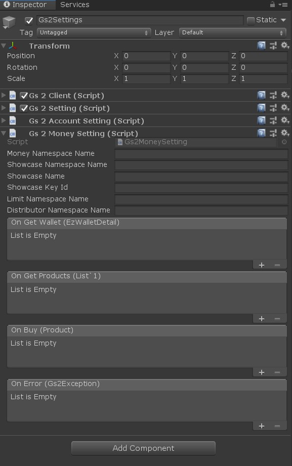
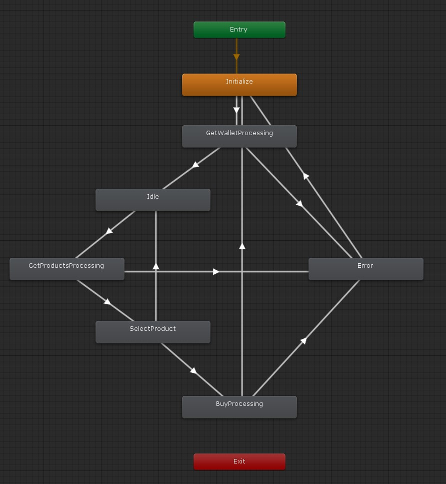

# 課金通貨販売

GS2-Money を使って管理されている課金通貨を、GS2-Showcase で販売するサンプルです。

サンプルにで定義されている商品のうち1つの商品は GS2-Limit による購入回数の制限がついており、１回しか購入できないようになっています。

# 初期設定

## Unity でプロジェクトを開く

`gs2-sample/unity/money` をプロジェクトとして開きます。
すると、 Unity Package Manager が依存関係を解決してプロジェクトを開きます。

## GS2-Deploy を使って初期設定をおこなう

- [initialize_credential_template.yaml - core](../core/initialize_credential_template.yaml)
- [initialize_account_template.yaml - account-registration-login](../account-registration-login/initialize_account_template.yaml)
- [initialize_money_template.yaml](initialize_money_template.yaml)

のスタックを作成します。
しばらく待ってすべてのスタックの状態が `CREATE_COMPLETE` になれば初期設定は完了です。

## Gs2Settings に設定を反映

Run シーンを開きます。


ヒエラルキーウィンドウで `Gs2Settings` を選択します。



インスペクターウィンドウで GS2-Deploy で作成したリソースの情報を登録します。

| スクリプトファイル | 設定名 | 説明 |
-----------------|------|------
| Gs2Settings | clientId | GS2 にアクセスするためのクレデンシャル（クライアントID） |
| Gs2Settings | clientSecret | GS2 にアクセスするためのクレデンシャル（クライアントシークレット） |
| Gs2AccountSettings | accountNamespaceName | GS2-Account のネームスペース名 |
| Gs2AccountSettings | accountEncryptionKeyId | GS2-Account でアカウント情報の暗号化に使用する GS2-Key の暗号鍵GRN |
| Gs2AccountSettings | gatewayNamespaceName | GS2-Gateway のネームスペース名 |
| Gs2MoneySettings | moneyNamespaceName | GS2-Money のネームスペース名 |
| Gs2MoneySettings | showcaseNamespaceName | GS2-Showcase のネームスペース名 |
| Gs2MoneySettings | showcaseName | GS2-Showcase の陳列棚名 |
| Gs2MoneySettings | showcaseKeyId | GS2-Showcase で商品購入時に発行するスタンプシートの署名計算に使用する暗号鍵 |
| Gs2MoneySettings | limitNamespaceName | 購入回数制限を実現する GS2-Limit のネームスペース名 |
| Gs2MoneySettings | distributorNamespaceName | 購入した商品を配送する GS2-Distributor のネームスペース名 |

コールバックを設定することで、イベントに合わせて処理を追加することができます。

| イベント | 説明 |
---------|------
| OnGetWallet(EzWalletDetail wallet) | ウォレットの情報を取得したとき。 |
| OnGetProducts(List<Product> products) | 販売中の商品一覧を取得したとき。 |
| OnBuy(Product product) | 商品の購入が完了したとき。 |
| OnError(Gs2Exception error) | エラーが発生したときに呼び出されます。 |

設定が出来たら Unity Editor 上でシーンを実行することで動作を確認できます。

## MoneyRequest

ステートマシンを動作させるために引数としてシーンに設定する Prefab。

**サンプルを Run シーンから実行する場合は自動的に生成されるため、設定する必要はありません。**

| パラメータ名 | 説明 |
------------|-----
| gameSession | ログイン済みのゲームセッション |

# ステートマシン



## ステートの種類

### Initialize

初期化ステートです。
`AccountTakeOverMenuStateMachine::Initialize()` を呼び出すことで `MainMenu` ステートに遷移します。

### GetWalletProcessing

最新のウォレットの状態を取得します。

```csharp
AsyncResult<EzGetResult> result = null;
yield return gs2Client.client.Money.Get(
    r => { result = r; },
    request.gameSession,
    gs2MoneySetting.moneyNamespaceName,
    Slot
);
```

### Idle

ウォレットの状態が取得し終わった状態です。
サンプルでは画面上に残高を表示し、残高の横の「＋」ボタンが押されるまで待機します。

### GetProductsProcessing

販売中の商品の一覧を取得します。

```csharp
AsyncResult<EzGetShowcaseResult> result = null;
yield return gs2Client.client.Showcase.GetShowcase(
    r => { result = r; },
    request.gameSession,
    gs2MoneySetting.showcaseNamespaceName,
    gs2MoneySetting.showcaseName
);
```

取得した商品情報をパースし、販売価格や入手できる課金通貨の数量を取得します。
購入回数制限が設定されている場合は、購入回数カウンターの状態も取得しています。

```csharp
var products = new List<Product>();
foreach (var displayItem in result.Result.Item.DisplayItems)
{
    var depositRequest = GetAcquireAction<DepositByUserIdRequest>(
        displayItem.SalesItem, 
        "Gs2Money:DepositByUserId"
    );
    var recordReceiptRequest = GetConsumeAction<RecordReceiptRequest>(
        displayItem.SalesItem, 
        "Gs2Money:RecordReceipt"
    );
    var countUpRequest = GetConsumeAction<CountUpByUserIdRequest>(
        displayItem.SalesItem, 
        "Gs2Limit:CountUpByUserId"
    );
    var price = depositRequest.price;
    var count = depositRequest.count;

    int? boughtCount = null;
    if(countUpRequest != null) {
        AsyncResult<EzGetCounterResult> result2 = null;
        yield return gs2Client.client.Limit.GetCounter(
            r => { result2 = r; },
            request.gameSession,
            countUpRequest.namespaceName,
            countUpRequest.limitName,
            countUpRequest.counterName
        );
        if (result2.Error == null)
        {
            boughtCount = result2.Result.Item.Count;
        }
        else if (result2.Error is NotFoundException)
        {
            boughtCount = 0;
        }
    }
    products.Add(new Product
    {
        Id = displayItem.DisplayItemId,
        ContentsId = recordReceiptRequest.contentsId,
        Price = price,
        CurrencyCount = count,
        BoughtCount = boughtCount,
        BoughtLimit = countUpRequest == null ? null : countUpRequest.maxValue,
    });
}
```

### SelectProduct

購入する商品を選択します。

### BuyProcessing

購入処理を実行します。

まずは Unity IAP を使用して AppStore や GooglePlay でコンテンツの購入を行います。
購入した結果得られたレシートを後続の処理で参照できるように保持しておきます。

```csharp
string receipt = null;
{
    AsyncResult<string> result = null;
    yield return new IAPUtil().Buy(
        r => { result = r; },
        product.ContentsId
    );
    receipt = result.Result;
}
```

購入したレシートを使って、GS2-Showcase の商品を購入する処理を実行します。
Config には GS2-Money のウォレットスロットと、レシートの内容を渡します。

```csharp
string stampSheet = null;
{
    AsyncResult<EzBuyResult> result = null;
    yield return gs2Client.client.Showcase.Buy(
        r => { result = r; },
        request.gameSession,
        gs2MoneySetting.showcaseNamespaceName,
        gs2MoneySetting.showcaseName,
        product.Id,
        new List<EzConfig>
        {
            new EzConfig
            {
                Key = "slot",
                Value = Slot.ToString(),
            },
            new EzConfig
            {
                Key = "receipt",
                Value = receipt,
            },
        }
    );
    stampSheet = result.Result.StampSheet;
}
```

取得したスタンプシートを実行します。
GS2 SDK for Unity ではスタンプシート実行用のステートマシンが用意されていますので、そちらを利用します。
ステートマシンの実行には GS2-Distributor と スタンプシートの署名計算に使用した暗号鍵が必要となります。

```csharp
{
    var machine = new StampSheetStateMachine(
        stampSheet,
        gs2Client.client,
        gs2MoneySetting.distributorNamespaceName,
        gs2MoneySetting.showcaseKeyId
    );

    Gs2Exception exception = null;
    machine.OnError += e =>
    {
        exception = e;
    };
    yield return machine.Execute();

    if (exception != null)
    {
        yield break;
    }
}
```

### Error

エラーが発生した場合に遷移するステートです。
`メニューに戻る` を選択すると `Initialize` に戻ります
