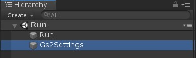
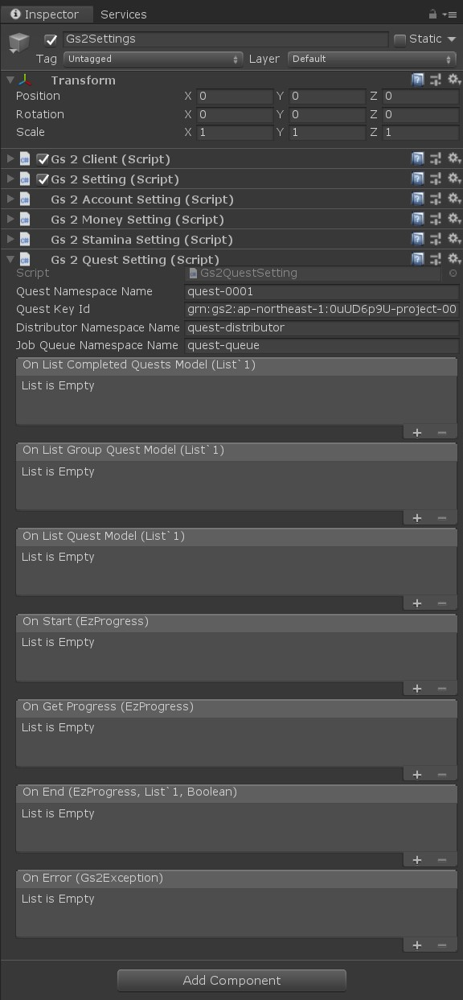
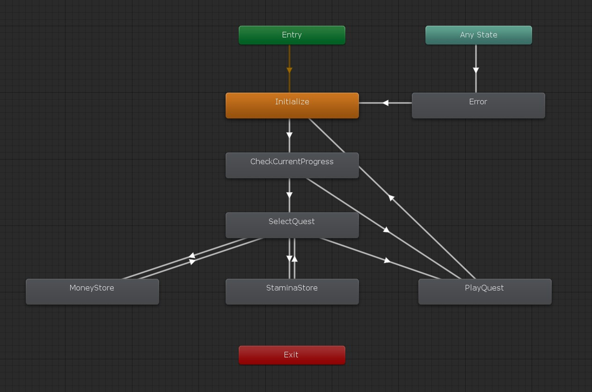
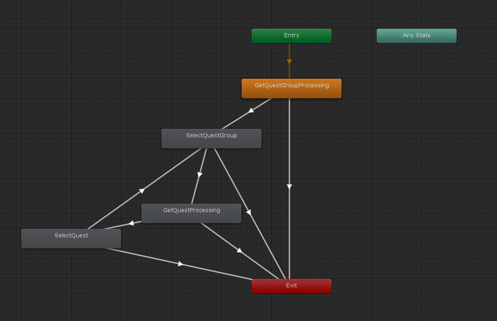
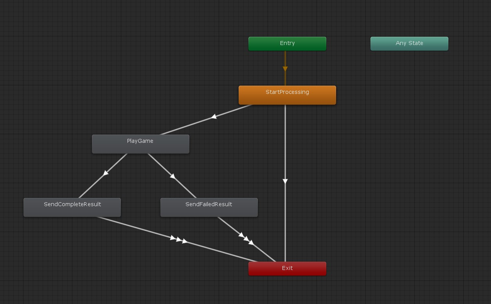

# クエスト

GS2-Quest を使ってクエストを管理するサンプルです。

クエストには、挑戦するために必要となるコストと、クリア報酬を設定できますが、  
このサンプルではコストにスタミナを、クリア報酬に課金通貨を設定しています。  
クエストに失敗した場合は報酬にコストとして費やしたスタミナを返すように設定しています。

# 初期設定

## Unity でプロジェクトを開く

`gs2-sample/unity/quest` をプロジェクトとして開きます。  
Unity Package Manager により、依存関係の解決に必要なパッケージのダウンロードが行われます。

## GS2-Deploy を使って初期設定をおこなう

- [initialize_credential_template.yaml - core](../core/initialize_credential_template.yaml)
- [initialize_account_template.yaml - account-registration-login](../account-registration-login/initialize_account_template.yaml)
- [initialize_money_template.yaml](../money/initialize_money_template.yaml)
- [initialize_stamina_template.yaml](../stamina/initialize_stamina_template.yaml)
- [initialize_quest_template.yaml](initialize_quest_template.yaml)

のスタックを順に作成します。  
しばらく待ってすべてのスタックの状態が `CREATE_COMPLETE` になれば初期設定は完了です。

## Gs2Settings に設定を反映

Run シーンを開きます。



ヒエラルキーウィンドウで `Gs2Settings` を選択します。



インスペクターウィンドウで GS2-Deploy で作成したリソースの情報を登録します。

| スクリプトファイル | 設定名 | 説明 |
-----------------|------|------
| Gs2Settings | clientId | GS2 にアクセスするためのクレデンシャル（クライアントID） |
| Gs2Settings | clientSecret | GS2 にアクセスするためのクレデンシャル（クライアントシークレット） |
| Gs2AccountSettings | accountNamespaceName | GS2-Account のネームスペース名 |
| Gs2AccountSettings | accountEncryptionKeyId | GS2-Account でアカウント情報の暗号化に使用する GS2-Key の暗号鍵GRN |
| Gs2AccountSettings | gatewayNamespaceName | GS2-Gateway のネームスペース名 |
| Gs2MoneySettings | moneyNamespaceName | GS2-Money のネームスペース名 |
| Gs2MoneySettings | showcaseNamespaceName | GS2-Showcase のネームスペース名 |
| Gs2MoneySettings | showcaseName | GS2-Showcase の陳列棚名 |
| Gs2MoneySettings | showcaseKeyId | GS2-Showcase で商品購入時に発行するスタンプシートの署名計算に使用する暗号鍵 |
| Gs2MoneySettings | limitNamespaceName | 購入回数制限を実現する GS2-Limit のネームスペース名 |
| Gs2MoneySettings | distributorNamespaceName | 購入した商品を配送する GS2-Distributor のネームスペース名 |
| Gs2StaminaSettings | staminaNamespaceName | GS2-Stamina のネームスペース名 |
| Gs2StaminaSettings | staminaName | GS2-Stamina のスタミナ名 |
| Gs2StaminaSettings | exchangeNamespaceName | スタミナの回復に使用する GS2-Exchange のネームスペース名 |
| Gs2StaminaSettings | exchangeRateName | スタミナの回復に使用する GS2-Exchange の交換レート名 |
| Gs2StaminaSettings | exchangeKeyId | GS2-Exchange で交換処理に発行するスタンプシートの署名計算に使用する暗号鍵 |
| Gs2StaminaSettings | distributorNamespaceName | 交換したスタミナ回復処理を配送する GS2-Distributor のネームスペース名 |
| Gs2QuestSettings | questNamespaceName | GS2-Quest のネームスペース名 |
| Gs2QuestSettings | questKeyId | GS2-Quest で報酬の付与処理に発行するスタンプシートの署名計算に使用する暗号鍵 |
| Gs2QuestSettings | distributorNamespaceName | 報酬を配送する GS2-Distributor のネームスペース名 |
| Gs2QuestSettings | queueNamespaceName | 報酬の付与に使用するGS2-JobQueue のネームスペース名 |

コールバックを設定することで、イベントに合わせて処理を追加することができます。

| イベント | 説明 |
---------|------
| OnListCompletedQuestModel(List<EzCompletedQuestList> completedQuests) | クリア済みのクエスト一覧を取得したとき。 |
| OnListGroupQuestModel(List<EzQuestGroupModel> questGroups) | クエストグループの一覧を取得したとき。 |
| OnListQuestModel(List<EzQuestModel> quests) | クエストの一覧を取得したとき。 |
| OnGetProgress(EzProgress progress) | 進行中で中断されたクエストを取得したとき。 |
| OnStart(EzProgress progress) | クエストを開始したとき。 |
| OnEnd(EzProgress progress, List<EzReward> rewards, bool isComplete) | クエストを完了したとき。 |
| OnError(Gs2Exception error) | エラーが発生したときに呼び出されます。 |

設定が出来たら Unity Editor 上でシーンを実行することで動作を確認できます。

## QuestRequest

ステートマシンを動作させるために引数としてシーンに設定する Prefab。

**サンプルを Run シーンから実行する場合は自動的に生成されるため、設定する必要はありません。**

| パラメータ名 | 説明 |
------------|-----
| gameSession | ログイン済みのゲームセッション |

# メインステートマシン



## ステートの種類

### Initialize

初期化ステートです。
課金通貨のウォレット表示やスタミナの残量表示ウィジェットを起動します。

### CheckCurrentProgress

進行中のクエストが存在しないか取得します。
存在しなければ `SelectQuest` へ、存在すれば `PlayQuest` へ遷移します。

```csharp
AsyncResult<EzGetProgressResult> result = null;
yield return gs2Client.client.Quest.GetProgress(
    r => { result = r; },
    request.gameSession,
    gs2QuestSetting.questNamespaceName
);
```

### SelectQuest

クエストの一覧を取得し、表示します。

### MoneyStore

課金通貨のストアを表示します。
この処理は [課金通貨サンプル](../money) に準拠しています。

### StaminaStore

スタミナのストアを表示します。
この処理は [スタミナサンプル](../stamina) に準拠しています。

### PlayQuest

クエストをプレイします。

### Error

エラーが発生した場合に遷移するステートです。
`メニューに戻る` を選択すると `Initialize` に戻ります

# クエスト選択ステータスステートマシン



### GetQuestGroupProcessing

クエストグループの一覧や、最新クリア済みクエストの状態を取得します。

```csharp
AsyncResult<EzDescribeCompletedQuestListsResult> result = null;
yield return gs2Client.client.Quest.DescribeCompletedQuestLists(
    r => { result = r; },
    request.gameSession,
    gs2QuestSetting.questNamespaceName
);
```

```csharp
AsyncResult<EzListQuestGroupsResult> result = null;
yield return gs2Client.client.Quest.ListQuestGroups(
    r => { result = r; },
    gs2QuestSetting.questNamespaceName
);
```

### SelectQuestGroup

クエストグループ一覧を表示した状態です。
クエストグループを選択するまで待機します。

### GetQuestProcessing

クエストの一覧を取得します。

```csharp
AsyncResult<EzListQuestsResult> result = null;
yield return gs2Client.client.Quest.ListQuests(
    r => { result = r; },
    gs2QuestSetting.questNamespaceName,
    questGroup.Name
);
```

### SelectQuest

クエスト一覧を表示した状態です。
クエストを選択するまで待機します。

# ゲームプレイステータスステートマシン



### StartProcessing

クエストを開始します。
Start の戻り値にはスタンプシートが返ります。
スタンプシートを実行することで対価を消費し、報酬としてクエストを開始状態にできます。

```csharp
AsyncResult<EzStartResult> result = null;
yield return gs2Client.client.Quest.Start(
    r => { result = r; },
    request.gameSession,
    gs2QuestSetting.questNamespaceName,
    questGroup.Name,
    quest.Name,
    config: new List<EzConfig>
    {
        new EzConfig
        {
            Key = "slot",
            Value = MoneyController.Slot.ToString(),
        }
    }
);
```

```csharp
EzProgress progress = null;

var machine = new StampSheetStateMachine(
    stampSheet,
    gs2Client.client,
    gs2QuestSetting.distributorNamespaceName,
    gs2QuestSetting.questKeyId
);

Gs2Exception exception = null;
machine.OnError += e =>
{
    exception = e;
};
machine.OnCompleteStampSheet += (sheet, stampResult) =>
{
    var json = JsonMapper.ToObject(stampResult.Result);
    var result = CreateProgressByStampSheetResult.FromDict(json);
    progress = new EzProgress(result.item);
};
yield return machine.Execute();
```

### PlayGame

ゲームをプレイするメインシーン

### SendCompleteResult

クエストが成功した場合の結果送信。
rewards は Start の戻り値で受け取った EzProgress に含まれている、クエスト内で取得可能な報酬のうち実際に入手した報酬を設定します。

End の戻り値にはスタンプシートが返ります。
スタンプシートを実行することで対価してクエストを終了状態にし、報酬を受け取れます。

```csharp
AsyncResult<EzEndResult> result = null;
yield return gs2Client.client.Quest.End(
    r => { result = r; },
    request.gameSession,
    gs2QuestSetting.questNamespaceName,
    progress.TransactionId,
    rewards,
    isComplete,
    new List<EzConfig>
    {
        new EzConfig
        {
            Key = "slot",
            Value = MoneyController.Slot.ToString(),
        }
    }
);
```

```csharp
var machine = new StampSheetStateMachine(
    stampSheet,
    gs2Client.client,
    gs2QuestSetting.distributorNamespaceName,
    gs2QuestSetting.questKeyId
);

Gs2Exception exception = null;
machine.OnError += e =>
{
    exception = e;
};
yield return machine.Execute();
```

#### 報酬配布処理の遅延実行

クエストの報酬に複数のリソースを設定した場合、スタンプシートによって付与される報酬ではジョブキューに報酬を入手するためのジョブを登録するところまでしか行われません。
そのため、ジョブキューを実行しなければ実際に報酬を受け取る処理が実行されません。

GS2-Sample Core はジョブキューを処理するためのユーティリティを持っており、それを使うとジョブキューの処理を簡単に取り扱えます。

```csharp
var executor = GameObject.Find("Gs2QuestInternalSetting").GetComponent<JobQueueExecutor>();
executor.jobQueueNamespaceName = "job"; // 処理するジョブキューのネームスペース名を設定
executor.onResult.AddListener(
    (job, statusCode, result) =>
    {
        // 実行したジョブとその結果がコールバックされる
    }
);

StartCoroutine(
    executor.Exec(
        gs2Client.profile,
        request.gameSession
    )
);
```


### SendFailedResult

クエストが失敗した場合の結果送信。
処理の流れは `SendCompleteResult` と同じです。


