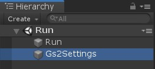
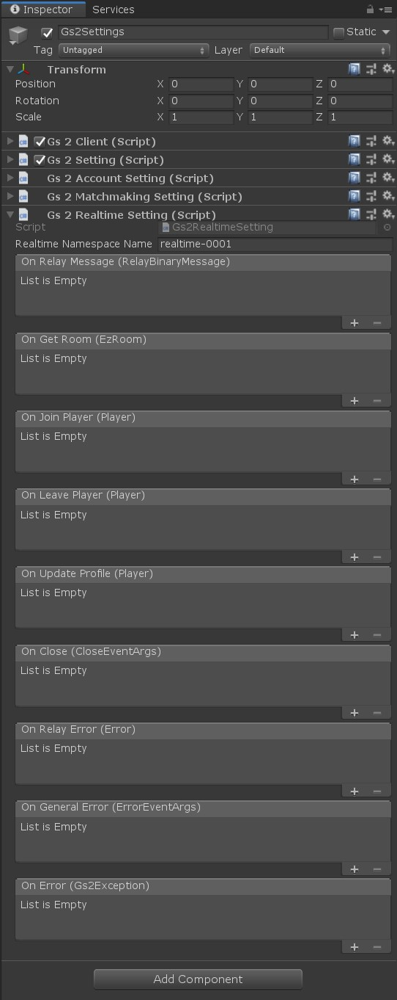

# リアルタイム対戦

GS2-Realtime を使用してプレイヤー間で通信するサンプル。

# 初期設定

## Unity でプロジェクトを開く

`gs2-sample/unity/realtime` をプロジェクトとして開きます。  
Unity Package Manager により、依存関係の解決に必要なパッケージのダウンロードが行われます。

## GS2-Deploy を使って初期設定をおこなう

- [initialize_credential_template.yaml - core](../core/initialize_credential_template.yaml)
- [initialize_account_template.yaml - account-registration-login](initialize_account_template.yaml)
- [initialize_realtime_template.yaml](initialize_realtime_template.yaml)

のスタックを作成します。  
しばらく待ってすべてのスタックの状態が `CREATE_COMPLETE` になれば初期設定は完了です。

### 注意事項

**initialize_matchmaking_template.yaml** を実行する必要はありません。  
**initialize_matchmaking_template.yaml** で作成されるマッチメイキングネームスペースは、マッチメイキング成立時に GS2-Realtime にゲームサーバを起動しない設定で作成されるため  
**initialize_realtime_template.yaml** にてそれらの設定をこのサンプルにとってより適切な設定でマッチメイキングネームスペースを作成します。

## Gs2Settings に設定を反映

Run シーンを開きます。



ヒエラルキーウィンドウで `Gs2Settings` を選択します。



インスペクターウィンドウで GS2-Deploy で作成したリソースの情報を登録します。

| スクリプトファイル | 設定名 | 説明 |
-----------------|------|------
| Gs2Settings | clientId | GS2 にアクセスするためのクレデンシャル（クライアントID） |
| Gs2Settings | clientSecret | GS2 にアクセスするためのクレデンシャル（クライアントシークレット） |
| Gs2AccountSettings | accountNamespaceName | GS2-Account のネームスペース名 |
| Gs2AccountSettings | accountEncryptionKeyId | GS2-Account でアカウント情報の暗号化に使用する GS2-Key の暗号鍵GRN |
| Gs2AccountSettings | gatewayNamespaceName | GS2-Gateway のネームスペース名 |
| Gs2MatchmakingSettings | matchmakingNamespaceName | GS2-Matchmaking のネームスペース名 |
| Gs2RealtimeSettings | realtimeNamespaceName | GS2-Realtime のネームスペース名 |

コールバックを設定することで、イベントに合わせて処理を追加することができます。

| イベント | 説明 |
---------|------
| OnRelayMessage(RelayBinaryMessage message) | リアルタイムゲームサーバからメッセージを受信したときに呼び出されます。 |
| OnGetRoom(EzRoom room) | リアルタイムゲームサーバのIPアドレス・ポート情報を取得したときに呼び出されます。 |
| OnJoinPlayer(Player player) | リアルタイムゲームサーバに新しいプレイヤーが参加したときに呼び出されます。 |
| OnLeavePlayer(Player player) | リアルタイムゲームサーバからプレイヤーが離脱したときに呼び出されます。 このコールバックは必ず OnJoinPlayer / OnLeavePlayer のいずれかと同じタイミングで呼び出されます。 |
| OnUpdateProfile(Player player) | 誰かがプレイヤープロフィールを更新したときに呼び出されます。 |
| OnRelayError(Error error) | リアルタイムゲームサーバでエラーが発生したときに呼び出されます。 |
| OnClose(CloseEventArgs error) | リアルタイムゲームサーバから切断されたときに呼び出されます。 |
| OnGeneralError(ErrorEventArgs error) | コネクション関連でエラーが発生したときに呼び出されます。 |
| OnError(Gs2Exception error) | エラーが発生したときに呼び出されます。 |

設定が出来たら Unity Editor 上でシーンを実行することで動作を確認できます。

## RealtimeRequest

ステートマシンを動作させるために引数としてシーンに設定する Prefab。

**サンプルを Run シーンから実行する場合は自動的に生成されるため、設定する必要はありません。**

| パラメータ名 | 説明 |
------------|-----
| gameSession | ログイン済みのゲームセッション |
| gatheringId | ゲームサーバ固有のID |
| ipAddress | ゲームサーバのIPアドレス |
| port | ゲームサーバの待ち受けポート |
| encryptionKey | ゲームサーバとの通信に使用する暗号鍵 |

# ステートマシン


## ステートの種類


### Initialize

初期化ステートです。
`RealtimeStateMachine::Initialize()` を呼び出すことで `GetRoom` ステートに遷移します。

### GetRoom

GS2-Realtime からルームの情報を取得します。  
ルーム情報の取得に成功すると `ConnectRoom` ステートに遷移し、失敗すると `Error` ステートに遷移します。

```csharp
/// <summary>
/// GS2-Realtime のギャザリング情報から GS2-Realtime のルーム情報を取得
/// </summary>
/// <param name="animator"></param>
/// <returns></returns>
private IEnumerator GetRoom(
    Animator animator
)
{
    if (room != null)
    {
        animator.SetTrigger(Trigger.GetRoomSucceed.ToString());
        yield break;
    }
    while (true)
    {
        yield return new WaitForSeconds(0.5f);
        
        AsyncResult<EzGetRoomResult> result = null;
        yield return _client.Realtime.GetRoom(
            r => { result = r; },
            _setting.realtimeNamespaceName,
            _gathering.Name
        );
    
        if (result.Error != null)
        {
            if (OnError != null)
            {
                OnError.Invoke(
                    result.Error
                );
            }

            animator.SetTrigger(Trigger.GetRoomFailed.ToString());
            yield break;
        }

        if (result.Result.Item.IpAddress != null)
        {
            room = result.Result.Item;
            break;
        }
    }

    animator.SetTrigger(Trigger.GetRoomSucceed.ToString());
}
```

### ConnectRoom

ルーム情報に記載されたゲームサーバの `IPアドレス` `ポート` に接続します。  
接続に成功すると `SyncPlayerProfiles` ステートに遷移し、失敗すると `Error` ステートに遷移します。

```csharp
/// <summary>
/// GS2-Realtime のルームに接続
/// </summary>
/// <param name="animator"></param>
/// <returns></returns>
private IEnumerator ConnectRoom(
    Animator animator
)
{
    session = new RelayRealtimeSession(
        _gameSession.AccessToken.token,
        room.IpAddress,
        room.Port,
        room.EncryptionKey,
        ByteString.CopyFrom()
    );
    
    session.OnRelayMessage += OnRelayMessage; 
    session.OnJoinPlayer += player =>
    {
        players[player.ConnectionId] = player;
        if (OnJoinPlayer != null)
        {
            OnJoinPlayer.Invoke(player);
        }
    };
    session.OnLeavePlayer += player =>
    {
        players.Remove(player.ConnectionId);
        if (OnLeavePlayer != null)
        {
            OnLeavePlayer.Invoke(player);
        }
    };
    session.OnGeneralError += args => 
    {
        if (OnError != null)
        {
            OnError.Invoke(
                new UnknownException(args.Message)
            );
        }
    };
    session.OnError += error =>
    {
        if (OnError != null)
        {
            OnError.Invoke(
                new UnknownException(error.Message)
            );
        }
    };
    session.OnUpdateProfile += player =>
    {
        if (players.ContainsKey(player.ConnectionId))
        {
            players[player.ConnectionId].Profile = player.Profile;
        }
        else
        {
            players[player.ConnectionId] = player;
            if (OnJoinPlayer != null)
            {
                OnJoinPlayer.Invoke(player);
            }
        }

        if (OnUpdateProfile != null)
        {
            OnUpdateProfile.Invoke(
                player
            );
        }
    };
    session.OnClose += args =>
    {
        animator.SetTrigger(Trigger.Disconnect.ToString());
        if (OnClose != null)
        {
            OnClose.Invoke(
                args
            );
        }
    };

    AsyncResult<bool> result = null;
    yield return session.Connect(
        _monoBehaviour,
        r =>
        {
            result = r;
        }
    );
    if (result.Error != null)
    {
        if (OnError != null)
        {
            OnError.Invoke(result.Error);
        }
        animator.SetTrigger(Trigger.ConnectRoomFailed.ToString());
        yield break;
    }

    if (!session.Connected)
    {
        animator.SetTrigger(Trigger.ConnectRoomFailed.ToString());
        yield break;
    }
    animator.SetTrigger(Trigger.ConnectRoomSucceed.ToString());

}
```

### SyncPlayerProfiles

ほかのプレイヤーの座標情報などを同期します。  
同期が完了すると `Main` ステートに遷移します。

### Main

タップまたはクリックした座標に移動します。  
定期的に自分の座標情報を送信します。他プレイヤーから座標を受け取った場合、そのプレイヤーの座標を移動します。

### Disconnected

ゲームサーバとの通信が切断されたときに遷移します。

### Error

エラーが発生した場合に遷移するステートです。  
`メニューに戻る` を選択すると `Initialize` に戻ります
