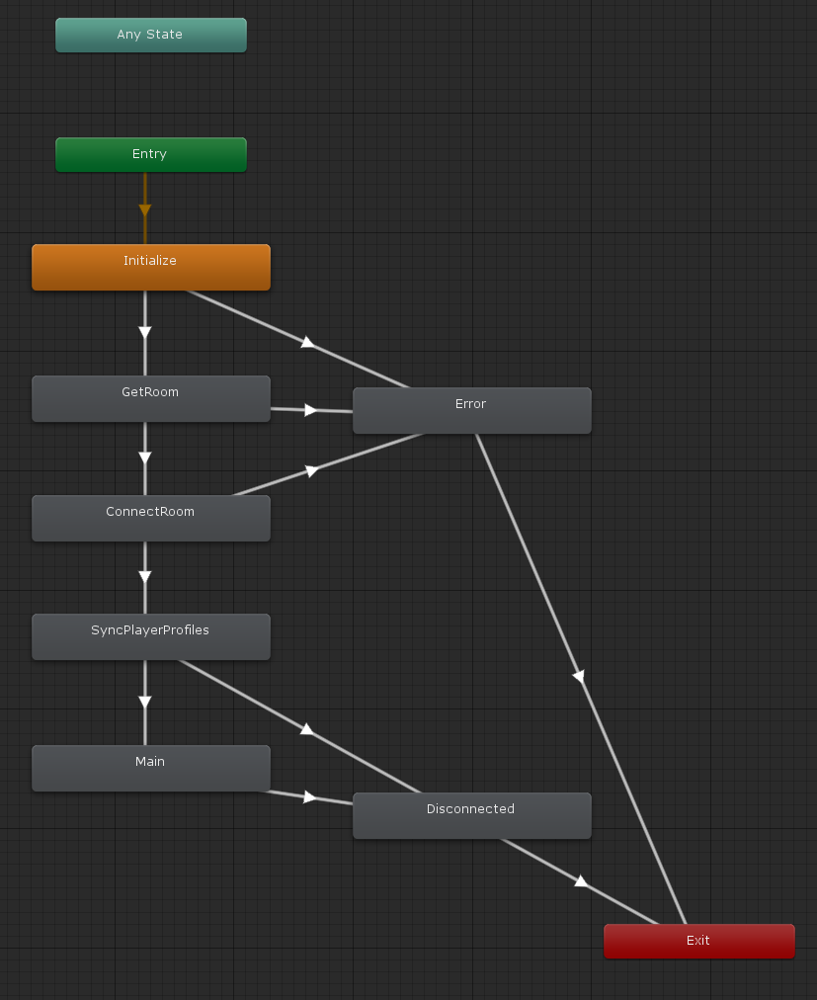

# リアルタイム対戦

GS2-Realtime を使用してプレイヤー間で通信するサンプル。

# 依存

- gs2-sdk-for-unity
- Core

# パラメータ

ステートマシンを動作させる際に指定するパラメータ

## RealtimeRequest

サンプルを動作させるために引数としてシーンに設定するコンポーネント。

### gameSession

ログイン済みのゲームセッション

### gathering

GS2-Matchmaking で成立したギャザリング情報

### room

テスト用に固定されたルームに接続する場合のルーム情報（IPアドレス・ポート・暗号鍵）

## Gs2RealtimeSetting

### realtimeNamespaceName

GS2-Realtime のネームスペース名

# ステートマシン



## ステートの種類


### Initialize

初期化ステートです。
`RealtimeStateMachine::Initialize()` を呼び出すことで `GetRoom` ステートに遷移します。

### GetRoom

GS2-Realtime からルームの情報を取得します。
ルーム情報の取得に成功すると `ConnectRoom` ステートに遷移し、失敗すると `Error` ステートに遷移します。

```csharp
/// <summary>
/// GS2-Matchmaking のギャザリング情報から GS2-Realtime のルーム情報を取得
/// </summary>
/// <param name="animator"></param>
/// <returns></returns>
private IEnumerator GetRoom(
    Animator animator
)
{
    if (room != null)
    {
        animator.SetTrigger(Trigger.GetRoomSucceed.ToString());
        yield break;
    }
    while (true)
    {
        yield return new WaitForSeconds(0.5f);
        
        AsyncResult<EzGetRoomResult> result = null;
        yield return _client.Realtime.GetRoom(
            r => { result = r; },
            _setting.realtimeNamespaceName,
            _gathering.Name
        );
    
        if (result.Error != null)
        {
            if (OnError != null)
            {
                OnError.Invoke(
                    result.Error
                );
            }

            animator.SetTrigger(Trigger.GetRoomFailed.ToString());
            yield break;
        }

        if (result.Result.Item.IpAddress != null)
        {
            room = result.Result.Item;
            break;
        }
    }

    animator.SetTrigger(Trigger.GetRoomSucceed.ToString());
}
```

### ConnectRoom

ルーム情報に記載されたゲームサーバの `IPアドレス` `ポート` に接続します。
接続に成功すると `SyncPlayerProfiles` ステートに遷移し、失敗すると `Error` ステートに遷移します。

```csharp
/// <summary>
/// GS2-Realtime のルームに接続
/// </summary>
/// <param name="animator"></param>
/// <returns></returns>
private IEnumerator ConnectRoom(
    Animator animator
)
{
    session = new RelayRealtimeSession(
        _gameSession.AccessToken.token,
        room.IpAddress,
        room.Port,
        room.EncryptionKey,
        ByteString.CopyFrom()
    );
    
    session.OnRelayMessage += OnRelayMessage; 
    session.OnJoinPlayer += player =>
    {
        players[player.ConnectionId] = player;
        if (OnJoinPlayer != null)
        {
            OnJoinPlayer.Invoke(player);
        }
    };
    session.OnLeavePlayer += player =>
    {
        players.Remove(player.ConnectionId);
        if (OnLeavePlayer != null)
        {
            OnLeavePlayer.Invoke(player);
        }
    };
    session.OnGeneralError += args => 
    {
        if (OnError != null)
        {
            OnError.Invoke(
                new UnknownException(args.Message)
            );
        }
    };
    session.OnError += error =>
    {
        if (OnError != null)
        {
            OnError.Invoke(
                new UnknownException(error.Message)
            );
        }
    };
    session.OnUpdateProfile += player =>
    {
        if (players.ContainsKey(player.ConnectionId))
        {
            players[player.ConnectionId].Profile = player.Profile;
        }
        else
        {
            players[player.ConnectionId] = player;
            if (OnJoinPlayer != null)
            {
                OnJoinPlayer.Invoke(player);
            }
        }

        if (OnUpdateProfile != null)
        {
            OnUpdateProfile.Invoke(
                player
            );
        }
    };
    session.OnClose += args =>
    {
        animator.SetTrigger(Trigger.Disconnect.ToString());
        if (OnClose != null)
        {
            OnClose.Invoke(
                args
            );
        }
    };

    AsyncResult<bool> result = null;
    yield return session.Connect(
        _monoBehaviour,
        r =>
        {
            result = r;
        }
    );
    if (result.Error != null)
    {
        if (OnError != null)
        {
            OnError.Invoke(result.Error);
        }
        animator.SetTrigger(Trigger.ConnectRoomFailed.ToString());
        yield break;
    }

    if (!session.Connected)
    {
        animator.SetTrigger(Trigger.ConnectRoomFailed.ToString());
        yield break;
    }
    animator.SetTrigger(Trigger.ConnectRoomSucceed.ToString());

}
```

### SyncPlayerProfiles

ほかのプレイヤーの座標情報などを同期します。
同期が完了すると `Main` ステートに遷移します。

### Main

タップまたはクリックした座標に移動します。
定期的に自分の座標情報を送信します。他プレイヤーから座標を受け取った場合、そのプレイヤーの座標を移動します。

### Disconnected

ゲームサーバとの通信が切断されたときに遷移します。

### Error

エラーが発生した場合に遷移するステートです。
`メニューに戻る` を選択すると `Initialize` に戻ります

# トリガー

ステートマシンのステート遷移をコントロールするトリガーです。

## InitializeSucceed

初期化が成功したときに発火するトリガーです。

## InitializeFailed

初期化が失敗したときに発火するトリガーです。

## GetRoomSucceed

ルーム情報の取得に成功したときに発火するトリガーです。

## GetRoomFailed

ルーム情報の取得に失敗したときに発火するトリガーです。

## ConnectRoomSucceed

ゲームサーバへの接続に成功したときに発火するトリガーです。

## ConnectRoomFailed

ゲームサーバへの接続に失敗したときに発火するトリガーです。

## SyncPlayerProfilesSucceed

ほかのプレイヤーの座標情報の同期に成功したときに発火するトリガーです。

## Disconnect

ゲームサーバから切断されたときに発火するトリガーです。

## ConfirmDisconnect

切断メッセージを表示して `メニューに戻る` を選択したときに発火するトリガーです。

## ConfirmError

エラー内容を表示して `メニューに戻る` を選択したときに発火するトリガーです。

# コールバック

ステートマシンの実装を拡張したいときに使用できるコールバックポイントを用意しています。
コールバックはメインスレッドから呼び出されます。

## OnChangeState(MatchmakingMenuStateMachine.State state)

ステートマシンのステートが変化したときに呼び出されます。

## OnError(Gs2Exception error)

エラーが発生したときに呼び出されます。

## OnDisconnect()

ゲームサーバから切断されたときに呼び出されます。