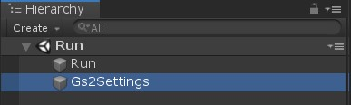
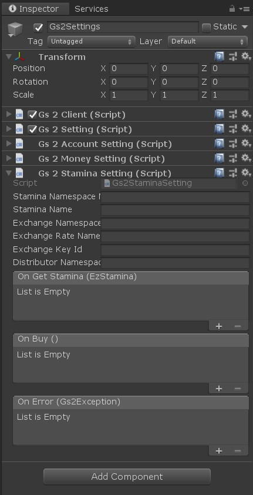
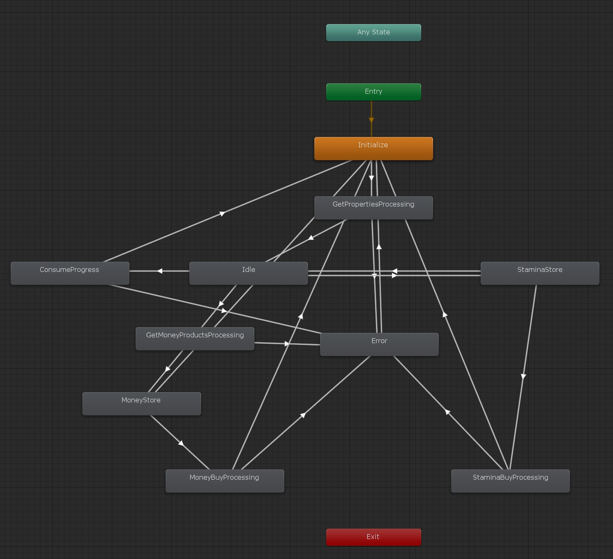
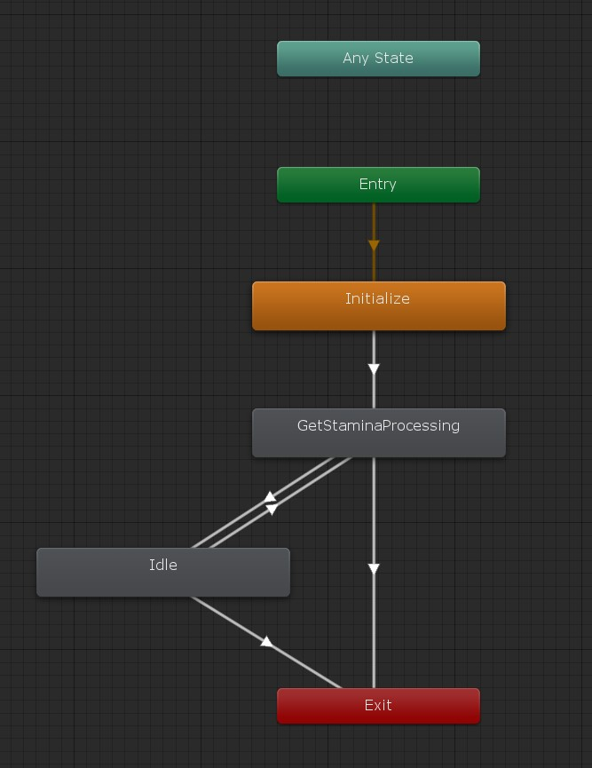
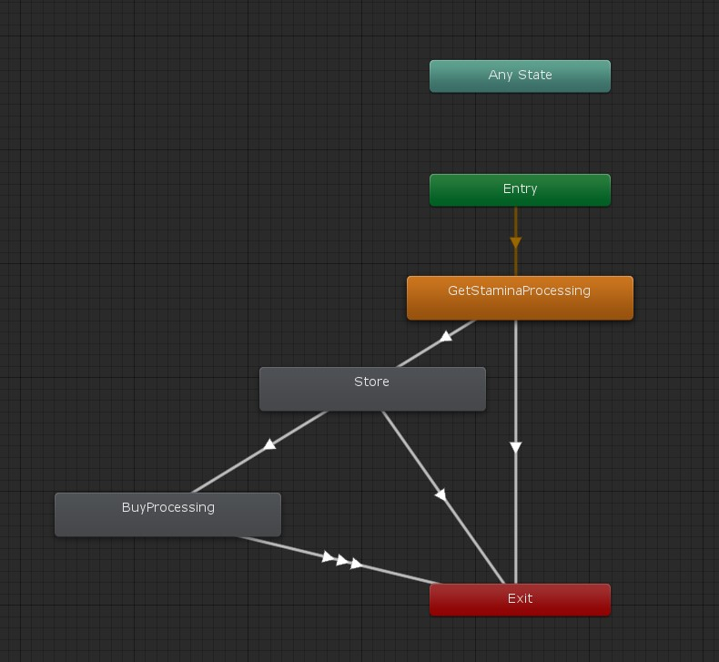

# スタミナ

GS2-Stamina を使ってスタミナ値を管理するサンプルです。
GS2-Exchange と連携して GS2-Money を消費してスタミナ値を回復することもできるようになっています。

# 初期設定

## Unity でプロジェクトを開く

`gs2-sample/unity/stamina` をプロジェクトとして開きます。
すると、 Unity Package Manager が依存関係を解決してプロジェクトを開きます。

## GS2-Deploy を使って初期設定をおこなう

- [initialize_credential_template.yaml - core](../core/initialize_credential_template.yaml)
- [initialize_account_template.yaml - account-registration-login](../account-registration-login/initialize_account_template.yaml)
- [initialize_money_template.yaml](../money/initialize_money_template.yaml)
- [initialize_stamina_template.yaml](initialize_stamina_template.yaml)

のスタックを作成します。
しばらく待ってすべてのスタックの状態が `CREATE_COMPLETE` になれば初期設定は完了です。

## Gs2Settings に設定を反映

Run シーンを開きます。



ヒエラルキーウィンドウで `Gs2Settings` を選択します。



インスペクターウィンドウで GS2-Deploy で作成したリソースの情報を登録します。

| スクリプトファイル | 設定名 | 説明 |
-----------------|------|------
| Gs2Settings | clientId | GS2 にアクセスするためのクレデンシャル（クライアントID） |
| Gs2Settings | clientSecret | GS2 にアクセスするためのクレデンシャル（クライアントシークレット） |
| Gs2AccountSettings | accountNamespaceName | GS2-Account のネームスペース名 |
| Gs2AccountSettings | accountEncryptionKeyId | GS2-Account でアカウント情報の暗号化に使用する GS2-Key の暗号鍵GRN |
| Gs2AccountSettings | gatewayNamespaceName | GS2-Gateway のネームスペース名 |
| Gs2MoneySettings | moneyNamespaceName | GS2-Money のネームスペース名 |
| Gs2MoneySettings | showcaseNamespaceName | GS2-Showcase のネームスペース名 |
| Gs2MoneySettings | showcaseName | GS2-Showcase の陳列棚名 |
| Gs2MoneySettings | showcaseKeyId | GS2-Showcase で商品購入時に発行するスタンプシートの署名計算に使用する暗号鍵 |
| Gs2MoneySettings | limitNamespaceName | 購入回数制限を実現する GS2-Limit のネームスペース名 |
| Gs2MoneySettings | distributorNamespaceName | 購入した商品を配送する GS2-Distributor のネームスペース名 |
| Gs2StaminaSettings | staminaNamespaceName | GS2-Stamina のネームスペース名 |
| Gs2StaminaSettings | staminaName | GS2-Stamina のスタミナ名 |
| Gs2StaminaSettings | exchangeNamespaceName | スタミナの回復に使用する GS2-Exchange のネームスペース名 |
| Gs2StaminaSettings | exchangeRateName | スタミナの回復に使用する GS2-Exchange の交換レート名 |
| Gs2StaminaSettings | exchangeKeyId | GS2-Exchange で交換処理に発行するスタンプシートの署名計算に使用する暗号鍵 |
| Gs2StaminaSettings | distributorNamespaceName | 交換したスタミナ回復処理を配送する GS2-Distributor のネームスペース名 |

コールバックを設定することで、イベントに合わせて処理を追加することができます。

| イベント | 説明 |
---------|------
| OnGetStamina(EzStamina stamina) | スタミナの情報を取得したとき。 |
| OnBuy() | 交換が完了したとき。 |
| OnError(Gs2Exception error) | エラーが発生したときに呼び出されます。 |

設定が出来たら Unity Editor 上でシーンを実行することで動作を確認できます。

## StaminaRequest

ステートマシンを動作させるために引数としてシーンに設定する Prefab。

**サンプルを Run シーンから実行する場合は自動的に生成されるため、設定する必要はありません。**

| パラメータ名 | 説明 |
------------|-----
| gameSession | ログイン済みのゲームセッション |

# メインステートマシン



## ステートの種類

### Initialize

初期化ステートです。
ウォレットステータスウィジェット と スタミナステータスウィジェット を作成します。

### Idle

ウォレットとスタミナの状態が取得し終わった状態です。
サンプルでは画面上に残高とスタミナを表示し、残高やスタミナの横の「＋」ボタンが押されるまで待機します。

### MoneyStore

課金通貨の販売ウィジェットを表示している状態です。
ウィジェットを閉じるまで待機します。

### StaminaStore

スタミナの販売ウィジェットを表示している状態です。
ウィジェットを閉じるまで待機します。

### ConsumeProgress

スタミナを消費します。

```csharp
AsyncResult<EzConsumeResult> result = null;
yield return gs2Client.client.Stamina.Consume(
    r => { result = r; },
    request.gameSession,
    gs2StaminaSetting.staminaNamespaceName,
    gs2StaminaSetting.staminaName,
    consumeValue
);
```

### Error

エラーが発生した場合に遷移するステートです。

# スタミナステータスステートマシン



### GetStaminaProcessing

最新のスタミナの状態を取得します。

```csharp
AsyncResult<EzGetStaminaResult> result = null;
yield return gs2Client.client.Stamina.GetStamina(
    r => { result = r; },
    request.gameSession,
    gs2StaminaSetting.staminaNamespaceName,
    gs2StaminaSetting.staminaName
);
```

### Idle

スタミナの状態が取得し終わった状態です。
サンプルでは画面上にスタミナを表示し、スタミナの横の「＋」ボタンが押されるまで待機します。

# ストアステートマシン



### GetStaminaProcessing

最新のスタミナの状態を取得します。

### Store

購入確認画面です。

### BuyProcessing

スタミナの購入処理を実行します。

```csharp
AsyncResult<EzExchangeResult> result = null;
yield return gs2Client.client.Exchange.Exchange(
    r => { result = r; },
    request.gameSession,
    gs2StaminaSetting.exchangeNamespaceName,
    gs2StaminaSetting.exchangeRateName,
    1,
    new List<Gs2.Unity.Gs2Exchange.Model.EzConfig>
    {
        new Gs2.Unity.Gs2Exchange.Model.EzConfig
        {
            Key = "slot",
            Value = MoneyController.Slot.ToString(),
        }
    }
);
```

`result.Result.StampSheet` にスタンプシートが返りますので

```
var machine = new StampSheetStateMachine(
    stampSheet,
    gs2Client.client,
    gs2StaminaSetting.distributorNamespaceName,
    gs2StaminaSetting.exchangeKeyId
);
yield return machine.Execute();
```

このようにスタンプシートを実行することで実際に課金通貨とスタミナ値の交換を実行します。
